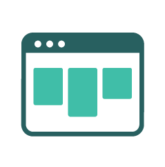

### 执行摘要 

虽然在过去的几十年里，许多软件方法论已经渐渐落伍，但很显然，DevOps并不是一种趋势，它正在成为软件开发和运营的标准方式。如今，企业团队正处于DevOps转型的不同阶段，努力实现更快、更安全的技术交付，以获得竞争优势。 

当开发人员与IT领导协同工作，消除路障，创建一个无缝的软件开发生命周期时，对组织的生产力、绩效、可视性、协作和创新都会产生不可思议的效果。   

也就是说，向DevOps过渡并不容易，也不直接。它需要重大的改变，包括：进化员工的思维方式，引入合适的工具，以及教授新的技能。无论你的DevOps转型在哪个阶段，你的重点都应该是持续改进。从基础开始，然后确定你独特的制约因素；一旦这些制约因素不再阻碍你，就重复这个过程。  

没有合适的工具是一个相当容易消除的制约因素，也值得投资。本报告的任务是提供指导，并从已经成功实施DevOps工具的开拓者那里获得最佳的DevOps工具。我们询问了全球的开发者社区，他们依靠哪些工具来实现DevOps的成功，我们很荣幸地提交这份报告，这份报告是基于2700多条回复的结果。

##### 主要研究结果

当谈到工具时，有用和易用的工具是消费者所期望的，但技术专家们往往认为，由于他们的专业知识，他们可以使任何工具发挥作用。实际上，事实恰恰相反：由于构建复杂系统和管理关键业务基础设施的困难程度，好的工具更重要。 

##### "绩效最高的工程师拥有易用的工具的可能性是最高的1.5倍。"  - DORA & Google Cloud发布的2019年DevOps状况报告 

在DevOps转型过程中，开发团队被授权对工具做出自己的决定，有助于提高软件交付绩效。他们还将工具自动化并集成到工具链中，从而腾出时间用于新的开发，并驳斥了那些认为实施起来太过耗时或昂贵的说法。  

##### 计划

###### 项目管理和问题跟踪 

###### 主要研究结果

无论你的团队是使用Scrum、Kanban还是敏捷项目管理的混合方法，你很可能已经做了很长时间的问题跟踪。项目管理和问题跟踪是DevOps计划过程的基础，当团队合作时，这些工具可以提供有价值的透明度、问责制和计划的准确性。 

集成和自动化在这个领域越来越重要，可以减少上下文切换，并提供跨平台执行和跟踪任务的能力。高绩效的技术团队经常将Slack和GitHub等工具集成到他们的问题跟踪流程中。

###### 工具

###### JIRA:

Jira是一个Atlassian工具，最初是作为Bug和问题跟踪器设计的。如今，Jira已经发展成为一个强大的工作管理工具，适用于各种用例，从需求和测试用例管理到敏捷软件开发。 

Jira提供了规划和路线图工具，因此团队可以管理利益相关者、预算和功能需求。Jira集成了各种CI/CD工具，以促进整个软件开发生命周期的透明度。当需要部署的时候，实时的生产代码状态信息会在Jira问题中浮现出来。集成的功能标记工具允许团队逐步、安全地推出新功能。

这是一个受欢迎的DevOps计划工具，因为它包括：发布和冲刺计划、CI/CD集成、问题管理、项目待办列表、功能标记、Jira服务台集成、以及其他开发者工具集成，是一个受欢迎的DevOps计划工具。它的可配置性很强，这对于复杂的项目管理来说是很好的，但如果你想找一个易于实施和维护的系统，它可能不是最好的选择。

###### Trello

Trello是一个项目管理工具，将项目组织成看板式的板子。2017年，Trello被Atlassian收购，此后，Trello作为Jira的轻量级替代方案，在软件开发团队中获得了很大的吸引力。如果你的组织还不是已经依赖Jira，你可以考虑使用Trello。它更容易配置和管理，而且通常情况下，开发人员更愿意与之对接，而不是Jira，由于所有的自定义功能，Jira可能会变得相当复杂，有时也会变得笨重。
 
Trello提供了基于Web和移动版本。你的项目板会告诉你正在做什么，由谁来做，以及在一个过程中处于什么位置。项目板上写满了卡片，这些卡片是你和你的团队的任务。你的团队可以对卡片进行评论和协作，每个卡片上都可以有照片、附件、截止日期等。
 
要想从Trello中获得更多的收益，你可以通过Power-Ups与其他开发工具如Slack和GitHub集成。

###### Glo Issue Boards 

Glo Issue Boards是在GitKraken工具套件中的由Axosoft开发的产品。如果你不熟悉的话，它与Trello类似，但Glo更以开发者为中心。这个任务和问题跟踪系统允许开发团队在看板、日历、时间线或仪表板中可视化任务。
Glo直接与GitHub集成，以减少开发团队在完成任务时的上下文切换。Glo与GitHub的问题和里程碑进行双向实时同步，因此开发人员和管理人员可以随时了解当前项目的进展情况。 
高绩效的开发人员依靠自动化来提高工作效率，而赋予自动化功能的计划/跟踪工具正是基于这个原因而变得非常强大。使用GitHub Actions很容易设置Glo卡自动化，以减少开发人员工作流中的步骤数：本质上是通过工作流实现任务的自动化进程。 
此外，将卡与拉动请求链接起来，可以进一步实现自动化。当GitHub中的拉动请求状态被更新时，Glo卡会根据你选择的映射自动推进到另一列。Glo与GitKraken Git GUI完全集成，因此开发者在GitKraken中创建GitHub的拉取请求时，可以实际链接一个Glo卡。这些自动化功能非常符合DevOps策略，可以减少上下文切换，提高效率。

###### GitKraken Timelines

GitKraken Timelines是Axosoft的一个产品，它是Axosoft在GitKraken 工具套件。它旨在帮助团队以时间轴视图的形式规划和沟通项目目标和里程碑。对于高层规划来说，这是一个很好的工具，可以快速传达即将到来的最后期限或回顾进度。每个里程碑都可以有一个图片或GIF以及相关的子项目。很容易叠加多个时间轴来比较不同项目或团队之间的截止日期。时间轴可以是私有的、协作的或公开的。而且它们可以通过链接、嵌入或演示模式轻松共享。 
 
当你开始进行DevOps转型时，考虑创建时间轴来清楚地传达主要的里程碑，每个里程碑需要完成哪些任务，以及相关的最后期限是什么。这个规划工具可以让每个人都朝着同一个目标前进。

###### 代码

###### 版本控制

###### 主要研究结果

版本控制是一种跟踪和管理代码修改的方法；允许开发人员看到项目的完整修改历史，并在需要时返回到以前的版本或文件。全球范围内的团队正在摆脱集中式版本控制系统（VCS），如Subversion，转而迁移到Git。根据Stack Overflow的开发者调查，由于Git是一种免费的分布式VCS，利用了分支和合并功能，现在超过90%的开发者都在使用Git进行版本控制。 

###### 托管服务

###### 主要研究结果

为了使用Git进行项目协作，你需要一个托管服务来托管你的存储库；另外，有些企业会选择将其托管在内部服务器上，以更好地满足其安全或部署需求。在决定使用哪种托管服务时，你的企业需要考虑价格、存储容量、与现有工具的集成度等等。企业团队将其存储库托管在多个服务上的情况也不少见。

###### 工具

###### GitHub 

在其核心部分，GitHub是一个托管和审核数以亿计的私有、公共和开放源码仓库的平台。GitHub也是构建该产品的公司的名字，它在2018年被微软收购。在我们的DevOps报告中，GitHub不仅在托管服务中排名第一，在我们的2020年20大开发者工具报告中，GitHub排名第7位。

GitHub正在不断扩展其产品，以配合DevOps工作流程中越来越多的流程。为了与GitHub存储库对接，许多开发者使用GitKraken Git GUI，它与GitHub.com和GitHub Enterprise无缝集成。GitHub提供了项目（Project）和问题（Issues）的基本项目管理。像Glo Issue Boards这样的工具提供了与GitHub同步的集成，可以提供更强大的计划和跟踪功能。GitHub的其他核心组件包括代码审核、安全开发，以及最近的CI/CD。 

###### Bitbucket 

Bitbucket是Atlassian的产品，首先是一个代码管理工具。为了与托管在Bitbucket上的Git repos对接，GitKraken的GUI和其他几个Git客户端与Bitbucket.org或Bitbucket Server集成，提供了一个精简的工作流程。

遵循DevOps的方法论，Bitbucket已经将其提供的服务扩展到不仅仅是托管，还包括项目规划、协作、测试和部署服务。正如你所期望的那样，Bitbucket提供了与Jira的紧密集成，Trello也有了与Bitbucket Cloud集成的Powerup。

###### GitLab

在我们的DevOps报告中，GitLab是最常用的托管服务的第3位，也是最受欢迎的托管服务。
#2020年Top 20开发者工具排行榜中的第14位。GitLab是最早全面拥抱DevOps的托管服务之一，此后一直致力于打造一个完整的DevOps平台。GitLab提供了管理、计划、创建、验证、打包、发布、配置、监控和安全应用的一切。为了进一步简化开发工作流程，可以利用GitKraken的GUI与GitLab.com和GitLab Self-Managed上的Git仓库进行集成。

###### Azure DevOps 

Azure DevOps是微软的一款产品，提供Git仓库托管、报告、需求管理、项目管理、自动构建、实验室管理、测试和发布管理功能。该产品于2018年发布，取代了Visual Studio Team Services (VSTS)等工具，并结合了许多其他工具，覆盖了整个应用生命周期，实现了DevOps功能。要扩展您的DevOps工具链并进一步简化开发，请将GitKraken Git GUI与您的Azure DevOps托管的Git仓库集成。
a
