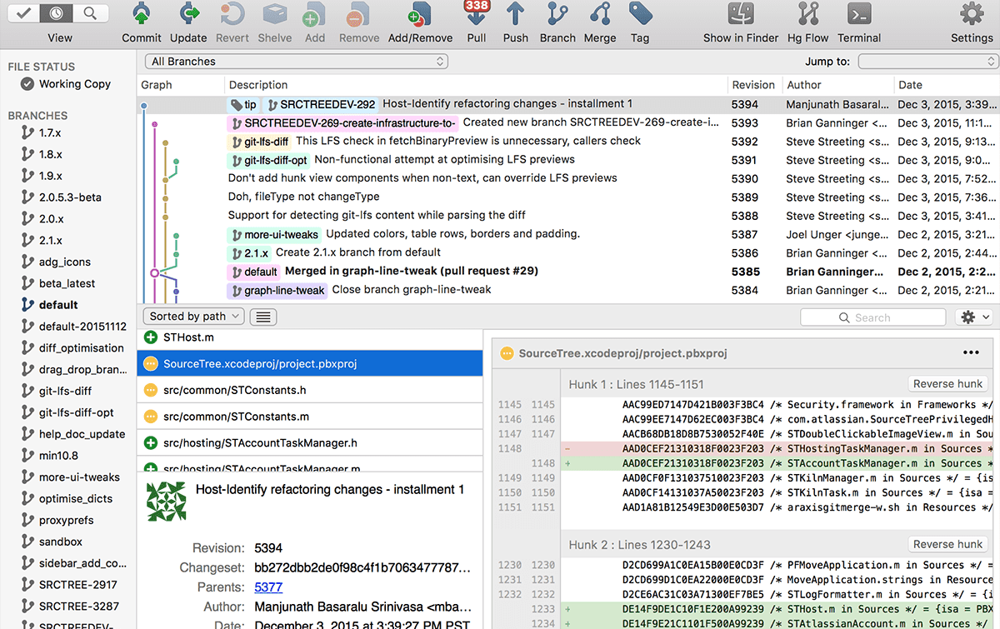
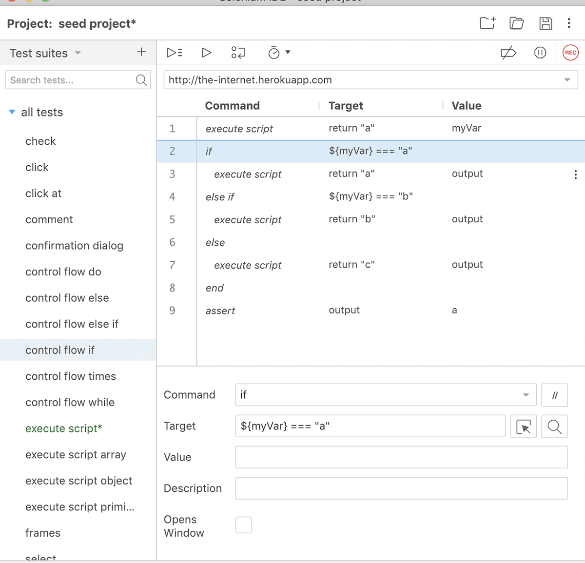

##### 源码管理客户端

###### 关键发现
源代码管理（SCM）系统是帮助团队和开发人员跟踪项目历史的工具。一个Git GUI（图形用户界面）将Git中发生的事情转换成一个你的眼睛和大脑都能很容易理解的界面。
GUIs提供了一个至关重要的清晰的视觉展现层，消除了CLI的黑匣子体验。GUIs还通过用简单的拖放操作代替记忆命令列表的需要，减少了Git的陡峭的学习曲线。在GitKraken Git GUI而不是CLI中执行所有这些任务更快、更高效：身份验证、克隆repo、查看提交图、查看远程URLs、查看文件差异、将更改从本地repo推送到远程、访问文件历史记录和错误、执行拉取请求和合并解决方案，以及执行一个交互式的rebase操作。
没有Git GUI，企业很难在所有开发团队中标准化和扩展Git的使用。GitKraken Git GUI的持续增长说明了为什么GUI方法对于用Git实现成功的DevOps工作流是不可或缺的。

###### 工具
 GitKraken Git GUI-连续四年被评为“开发者工具”的第一名，GitKraken Git GUI是由Axosoft构建的GitKraken工具套件中的旗舰产品。它允许开发人员在彩色图形中可视化Git存储库的历史，并将复杂的Git命令简化为拖放操作。通过内置的合并冲突编辑器、交互式rebase模式、内置的代码编辑器、集成工具等，GitKraken Git GUI为有经验的开发人员简化了的Git工作流，并减少了刚接触Git的人员的陡峭的学习曲线。
GitKraken在其他客户端中脱颖而出，因为它是兼容Linux、Mac和Windows的为数不多的GUI之一，而GitHub Desktop和Sourcetree不支持Linux。它在DevOps工作流中扮演着关键的角色，它紧密地连接了各种代码工具：Git客户端、托管服务和IDE（它使用了VS Code内置的Monaco代码编辑器）。
GitKraken Git GUI集成了上一节中列出的所有顶级的Git托管服务：GitHub、GitLab、Bitbucket和Azure DevOps，以及它们的自托管服务（不包括TFS），可以从GitKraken内部实现以下所有功能：在托管帐户上创建存储库，包括.gitignore文件和license文件；自动生成一个SSH密钥对，并将其添加完成；fork存储库；将身份验证保存到配置文件中；从您的repo列表中克隆；为repo添加远程地址；使用添加的分配者、审阅者和标签创建pull requests；查看pull requests的构建状态。
GitKraken Git GUI还通过连接计划和代码步骤，支持无缝的DevOps工作流。GitKraken Git GUI内置了Glo Issue Boards和GitKraken Timelines等规划工具。为了便于跟踪，Git GUI中的存储库可以与Glo Boards相关联。当创建一个新的GitHub pull request时，只需链接一个Glo card；这将自动更新GitHub中的pull request描述，以包含到该卡的链接。另外，GitKraken Git GUI与Glo Issue Boards、Jira、GitHub Issues和GitLab Issues的更紧密、更强大的集成版本即将推出！

 Git CLI-在Git GUI之前，程序员被迫使用命令行界面（CLI）。CLI继续被广泛使用，因为它是免费的，许多人仍然通过记忆命令来学习Git。此外，它还提供了额外的好处，即能够使用脚本自动执行某些任务。一些开发人员也不希望依赖于GUI应用程序，而是希望看到他们输入的命令的输出。

 GitHub Desktop-顾名思义，GitHub Desktop是一个GitHub工具，在微软旗下。由于GitHub.com拥有广泛的用户群，该工具已被广泛采用。对于GitHub用户来说，它是一个免费的、易于使用的工具，但是它的功能不如GitKraken Git GUI或Sourcetree那么强大。对于那些不使用GitHub作为托管服务的，或使用多个托管服务的人来说，GitLab、Bitbucket或Azure DevOps没有集成其中，这是一个相当重要的工作流的障碍。
GitHub Desktop非常适合已经使用GitHub.com并且需要基本Git客户端功能的Windows和Mac开发人员，例如：与协作者一起分配提交；使用pull request检出分支，并查看CI状态；语法突出显示的差异；扩展的镜像差异支持。Git客户端不适用于Linux用户或团队，这些用户或团队需要一个客户端来进行：交互式rebase、提交签名、GitFlow、子模块、blame、打开多个repo、自动存储、提交模板、文件/差异视图、文件编辑等。GitHub Desktop也没有提交图，因此可视化项目历史的能力有限。

 Sourcetree-Sourcetree是Atlassian产品，2010年首次向公众发布。这个Git客户端对Windows和Mac是免费的，但不支持Linux。作为市场上最早的Git GUIs之一，Sourcetree能够在开发人员中获得巨大的吸引力，特别是那些已经使用了类似Jira和Bitbucket的Atlassian产品的开发人员。
Sourcetree的功能比GitHub桌面丰富得多，与GitKraken Git GUI的功能更接近。然而，Sourcetree缺少模糊查找器、语法突出显示、自动存储、文件/差异视图、文件编辑和pull request模板。
说到DevOps，Sourcetree提供了与GitHub、GitLab和Azure DevOps的集成，主要对手是Bitbucket。

##### 集成开发环境

###### 关键发现
由于IDEs提供的便利性，它们越来越受到软件开发人员的欢迎。IDE是一个软件套件，它将开发人员用来编写和测试软件的许多工具整合到一个用户界面中。IDEs提供了较少上下文切换的优势，这就是为什么许多工具都朝着这个方向发展，比如：GitKraken Git GUI及其内置的代码编辑器、合并冲突工具和集成的问题跟踪功能。

###### 工具
 VS Code-VS Code不仅是我们DevOps报告中排名第一位的IDE，而且在2020年、2019年和2018年的20个顶尖开发工具中，它还排名第二位。VS Code是一个非常流行的代码编辑器，用于在Windows、Mac和Linux上编写、构建和调试web和云应用程序。
作为微软公司的工具，它还具有与Azure、AWS、.NET紧密集成的额外优势，以及一个庞大的插件的生态系统，允许您连接、构建和调试许多工具和技术。通过VS Code与Azure一起使用可以简化DevOps工作流，以便轻松部署和托管基于React、Angular、Vue、Node、Python等构建的站点。此外，使用VS Code的Glo Issue Boards插件，可以加快任务和问题跟踪。

 IntelliJ IDEA- IntelliJ IDEA是Jetbrains提供的Java开发IDE，它创建了一整套开发工具。虽然IntelliJ没有VS Code那么流行，但它是DevOps报告中使用最多的IDE的第二位，也是2020年的前20个最好的开发工具中的第9位。该开发工具的吸引力逐年上升，在我们的20大开发工具报告中，2019年排名第10位，2018年排名第11位。
IntelliJ IDEA作为编程软件，提供了快速直观的体验。虽然IntelliJ是一个用于Java的IDE，但它也理解并为其他各种语言，比如：SQL、JPQL、HTML、JavaScript等，提供智能编码帮助。
为了增强DevOps工作流，IntelliJ IDEA支持Maven、Gradle、Ant、Gant等构建工具，以帮助自动化编译、打包、运行测试、部署和其他活动。为了方便地执行单元测试，IntelliJ包含了主要测试框架的测试运行程序和覆盖工具，包括JUnit、TestNG、Spock等。此外，IntelliJ IDEA还提供了一个专用的工具窗口，允许您连接到本地运行的Docker来管理镜像、容器和Docker Compose服务。

 Visual Studio-Visual Studio是微软开发的另一个IDE，不要与Visual Studio Code（VS Code）混淆。它也很受欢迎，在我们的DevOps报告中排名第三，在2020年的前20个开发工具中排名第四。这个集成开发环境包括所有平台和语言的工具和服务。
Visual Studio提供了一些特性来帮助处理DevOps工作流的各个部分：开发、分析、调试、测试、协作和部署。此外，作为一个微软工具，Visual Studio通过Azure的项目模板和直接部署到Azure，使Azure开发更加容易。另外，Visual Studio还有一个扩展市场，可以与其他流行的开发工具集成。

 Sublime Text-Sublime Text是一个跨平台的文本编辑器，用于代码、标记和文本。这个成熟的IDE是稳定和快速的。它具有自动完成、语法突出显示和代码折叠功能。Sublime Text是DevOps报告中使用最多的第4个IDE，也是2020年前20个开发工具中使用最多的第8个IDE。

#### 构建

##### 构建工具
 Jenkins-Jenkins是一个开源的自动化服务器，允许组织通过自动化来加速他们的软件开发。Jenkins在整个DevOps生命周期中管理和控制软件交付过程，包括构建、测试、运营和部署。设置Jenkins以监视GitHub、Bitbucket或GitLab上的任何代码更改，并使用Maven和Gradle等工具自动进行构建。利用容器技术，如Docker和Kubernetes，启动测试，然后在生产中采取回滚或前滚等操作。

 Maven-Maven是一个构建自动化工具，主要用于Java项目，但也可以用于构建和管理用C#、Ruby、Scala和其他语言编写的项目。Maven项目由Apache软件基金会托管。
团队可以使用Maven的项目对象模型（project object model，POM）和一组插件，来使用统一的构建系统构建项目。一旦您的团队熟悉了一个Maven项目是如何构建的，您就会知道所有Maven项目是如何构建的，从而在尝试确定许多项目时节省了时间。

 Visual Studio-Visual Studio的Windows和Mac版本有用于所有.NET语言的内置编译器工具。使用它可以立即创建构建，并在调试器中测试它们；为C++和C类项目运行多处理器构建；自定义构建系统的不同方面。您可以使用MSBuild命令行工具来自动化Ci/CD管道中的构建，或者在Windows和Linux中使用CMake工具运行C++构建。

 Gradle-Gradle是一个开源的构建自动化系统，可以帮助团队更快地构建、自动化和交付更好的软件。开发人员可以使用Gradle来编写Java、C++、Python等，并在任何平台上打包部署。Gradle的插件和集成生态系统帮助团队扩展自动化。端到端地对软件的交付进行建模、集成和系统化，并使用快速构建扩展开发。Gradle提供了许多功能，从编译避免到高级缓存，再到支持持续交付。

#### 测试

###### 关键发现
测试框架对于成功的DevOps策略是不可或缺的，因为它们有助于为创建和设计测试用例提供高级指导。测试框架提供了实践和工具的组合，旨在帮助开发和QA团队更有效地测试。
测试工具可以帮助企业团队提高测试速度、提高准确性、降低维护成本和降低出错风险。有了高效的DevOps工作流，开发人员可以在持续交付期间使用这些工具，来减少QA的监督。

###### 工具
 JUnit-JUnit是一个面向Java的开源单元测试框架。JUnit对于在测试驱动环境中工作的开发人员非常有用，因为它有助于在代码的早期发现错误，从而使代码更加可靠。单元测试还迫使开发人员花更多的时间阅读代码而不是编写代码。这会产生更可读、更可靠、无错误的代码，从而在开发过程中建立信心。

 Selenium-Selenium是一套自动化web浏览器的工具。它提供了一个回放工具，用于编写功能测试，而无需学习测试脚本语言。
Selenium WebDriver是一组特定于语言的绑定，用于驱动浏览器。它帮助QA团队创建健壮的、基于浏览器的回归自动化套件和测试，并可以跨许多环境扩展/分发脚本。
Selenium IDE是一个Chrome和Firefox插件，可以简单地记录和回放与浏览器的交互。它帮助QA团队创建快速的bug复制脚本，以及用于自动化辅助的探索性测试脚本。
Selenium Grid非常适合希望通过在多台机器上分发和运行测试来扩展规模的QA团队，同时从一个中心点管理多个环境。这使得在各种浏览器和操作系统上运行测试变得很容易。

 Jest-Jest是一个JavaScript测试框架，可以与Babel、TypeScript、Node、React、Angular和Vue一起工作。Jest速度快，几乎不需要配置。它使用快照测试来跟踪大型对象；快照可以与测试一起运行，也可以嵌入代码。

 PHPUnit-PHPUnit是一个面向程序员的PHP测试框架。它是单元测试框架的xUnit架构的一个实例。许多现代PHP框架都带有PHPUnit集成，包括Laravel、Symfony和CakePHP。CMS包括Wordpress和Drupal也使用它进行测试。

