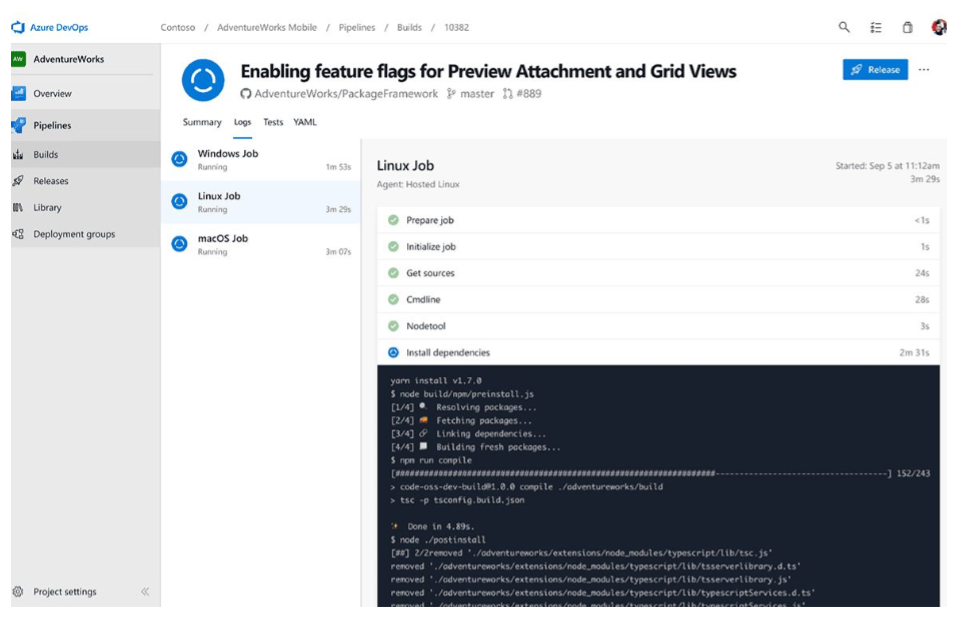

#### 发布

##### 配置管理

##### 
Ansible为基础设施、应用、网络、容器、安全乃至更多其他多样性的系统提供了简单的自动化方案。Ansible通过配置对基础设施的数据信息进行直接描述，提升了文档的可读性。系统管理除了账号密码或者SSH密钥外，再也无需它物。不需要再安装代理软件，避免了自动化系统常见的“为了管理而管理代理软件”的问题。Ansible依赖于OpenSSH，而它又是最安全的远程配置管理系统之一。

Ansible不仅在DevOps报告中位列配置管理工具第一名，而且在2019年Stack Overflow的开发者调查显示：62%的使用过Ansible的开发者都特别喜欢这个工具。

 

Azure DevOps是由微软创建的一系列DevOps解决方案的集合。使用Azure云的自动化功能简化了其中的配置管理。整个系统的资源配置的统一管理增强了系统状态的可靠性，做到随时回滚配置更新，自动化处理异常修改和问题排查。

编辑和管理PowerShell的配置，导入配置脚本，生成节点配置，这些都可以在云上完成。使用Azure配置管理来监测和自动化更新物理机和虚拟机的配置。

Chef 是一个处理物理机、虚拟机和云上主机的配置管理工具。它赋能IT流程的持续自动化，促进企业组织的高效团队协作，Chef Automate利用chef、Habitat和InSpec构建横跨内外边界的管道，标准化本地数据中心和公有云的环境和流程。

DevOps人员利用相同的工具把配置编程代码，流程化处理申请，高效的准备环境和发布应用。

##### 持续集成/交付（CI/CD）

###### 关键发现

持续集成是DevOps最佳实践之一，旨在一天多次合并代码到同一个共享库，然后从此库开展自动化构建和测试。CI助力于企业研发小组快速监测错误，减少合并错误，避免问题积压恶化。

持续交付在CI之上更进一步，使得软件可以在任意时间内发布到生产环境，通常自动化推送更新到临时系统中。企业研发小组认为DevOps的CD实践保证了每次的修改都能发布，而且还降低了每次发布的风险。这让企业通过更频繁的提供价值获得竞争优势，创建更为紧密的客户反馈闭环。

###### 工具

###### 

Jenkins 是我们调研报告中排名第一的CI/CD工具；它有助于企业通过自动化加速软件开发。Jenkins通过DevOps生命周期控制和管理着整个软件的交付周期，包括：构建、测试、运维和部署。通过Jenkins来监控GitHub、Bitbucket 或者GitLab中的任何代码变化，并自动触发利用Maven或者Gradle编译的构建。利用如Docker和Kubernetes的容器技术初始化测试环境，并在生产环境中进行回滚或前滚。

###### 

GitLab通过自行演进，成为了一个覆盖整个DevOps周期的应用。因此GitLab CI/CD只是整个GitLab应用中的一小部分，提供从计划到部署的无缝用户体验。可以利用GitLab CI/CD在Unix、windows、macOS或者任何运行Go语言的环境，此外还支持多机器构建，以加快速度执行速度。GitLab CI/CD还支持实时日志输出、柔性pipeline和可视化pipeline、自动拓展、制品构建、支持Docker和容器注册等等。

###### 

Azure DevOps是由微软创建的一系列DevOps解决方案的集合。开发人员利用它可以自动化从编码到上云的整个持续集成和持续交付的DevOps流程。

通过Azure的端到端的解决方案，开发团队可以实现整个应用生命周期(计划、开发、交付和运营)内任何阶段内的DevOps实践。通过与Visual Studio和VS Code的紧密集成，开发者更容易在Azure DevOps上致力于自己的CI/CD流水线。

###### 

Travis CI是由Github提供的持续集成服务，用于构建和测试上传在它上面的工程。相较于Jenkins，使用Travis CI的一大优势是更快的初始化：登录GitHub、测试工程、推送至GitHub一气呵成。如果你所在的组织利用Github开展开源项目，Travis CI是一个好选项。Travis CI还集成了广受欢迎的通讯工具，例如Slack，以保证开发团队随时了解构建状态。

#### 部署

###### 关键发现

持续部署是企业拥有成熟的DevOps流程后的一项进阶的DevOps实践，它比持续交付更近一步，可以自动化部署更新到生产环境中，而不是其他非生产环境。研发小组不管是部署到生产还是非生产环境，都需要一个工具来实现部署策略。

###### 工具

###### 

Jenkins 不仅仅只是一个构建工具，同时也是持续交付解决方案中被采用的最广泛的工具之一。无法计数的Jenkins插件，让其几乎能整合任意工具，包括整个持续交付流程中所有最经典的解决方案。Jenkins插件让开发人员可以通过网络部署docker镜像，部署到Kunenetes机群。使用Pipeline插件，开发人员还可以调用云服务提供商（AWS/Azure）的API通过流程即代码的方式部署任意服务。

###### 

Azure DevOps 是一套微软提供DevOps解决方案，Azure Pipeline是其中的一个服务，它可以用于自动化构建和部署到众多的云提供商，尤其是Azure。

如果贵公司开发了一个.NET、Java、Node、PHP或者Python的App，Azure Pipeline可以帮助您设定一套高度定制化的持续集成和持续交付的流水线。

###### 

AWS CodeBuild 是一套掌控全局的集成服务：编译代码、运行测试、生成带部署的软件包。它还不需要服务器来部署和扩展，也不需要安装、配置和运维任何软件。

AWS CodeBuild是 AWS Code Services家族中的一员，通过AWS Code Services可以创建、完成和自动化软件持续集成和持续交付的发布流程。你也可以只集成Code Build到已存在的CI/CD流程中去。例如: 可以利用Code Build当作已有的Jenkins的一个节点来设置分布式构建。

###### 

GitLab CI/CD不仅仅只能测试、构建项目，还能够部署到基础设施上。GitLab为每个环境提供完整的部署历史记录，且能够持续追踪部署状态，因此可以查询到当前服务器的部署信息。如果项目连接的是Kubernetes，也可以用它来辅助部署。

GitLab致力于自动化发布与交付应用，缩短交付周期，加速手动流程，提高团队效率。随着无触化持续交付被引入流水线，系统自动获取信息识别做要做的事情，进而实现自动化多环境部署，不管是生产还是非生产环境，甚至实现更加高级的方式，如金丝雀发布。通过特性开关、内置审计/可追溯性、按需环境创建和GitLab的静态内容交付页面，可以实现更有信心的更快速的交付。

#### 运营

##### 容器

###### 

Docker这一个工具的设计目标是使用容器来更简单的创建、部署和运行应用。Docker容器把软件和其依赖环境结合在一起设置成一个标准化单元来部署，该单元包含运行所需的一切：代码、运行时、系统工具和标准库。企业团体使用Docker容器来保证应用始终运行一致，让协作变得像分享容器镜像一样简单。

Docker不仅仅在这篇DevOps报告中位列容器工具排行榜第一，而且在2019年Stack Overflow的开发者调查显示：Docker还是排名第三的最通用平台，35%专业开发者报告说他们在Docker平台上开发过东西，Docker还是该报告中排名第二的最受喜爱的平台。

###### 

###### 

#### 监控

##### 分析/监控

##### 即时通讯

### 总结
