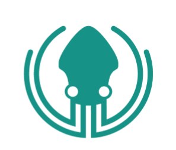
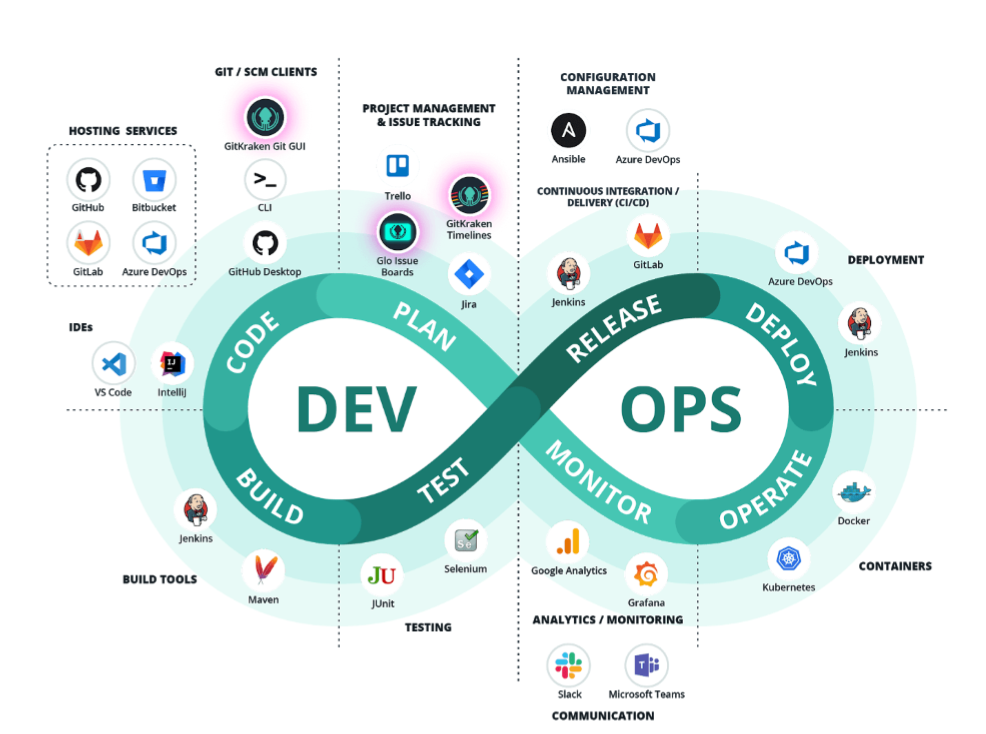

DevOps Tools Report 2020

<b>By GitKraken</b>

<b>Translator: 吴平福 周一行 付文新</b>

目录

### 摘要

### 调研结论

#### 计划

##### 项目管理和问题跟踪

###### 关键发现

###### 工具

#### 编码

##### 版本控制

###### 关键发现

##### 服务托管

###### 关键发现

###### 工具

##### [源码管理客户端](./Part2.md)

###### 关键发现

###### 工具

##### 集成开发环境

###### 关键发现

###### 工具

#### 构建

##### 构建工具

#### 测试

###### 关键发现

###### 工具

#### [发布]()

##### 配置管理

##### 持续集成/部署（CI/CD）

###### 关键发现

###### 工具

#### 部署

###### 关键发现

###### 工具

#### 运营

##### 容器

#### 监控

##### 分析/监控

##### 即时通讯

### 总结

